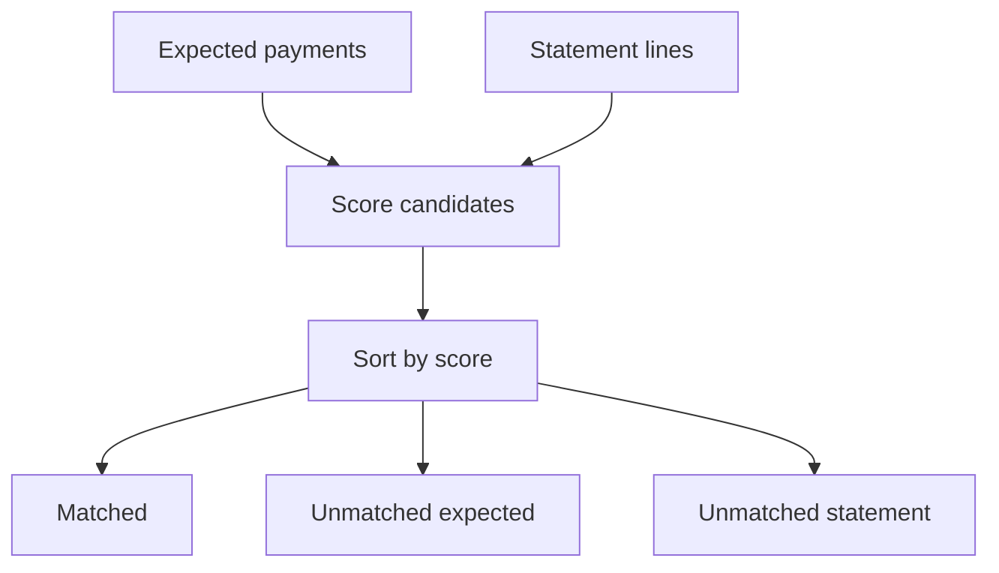
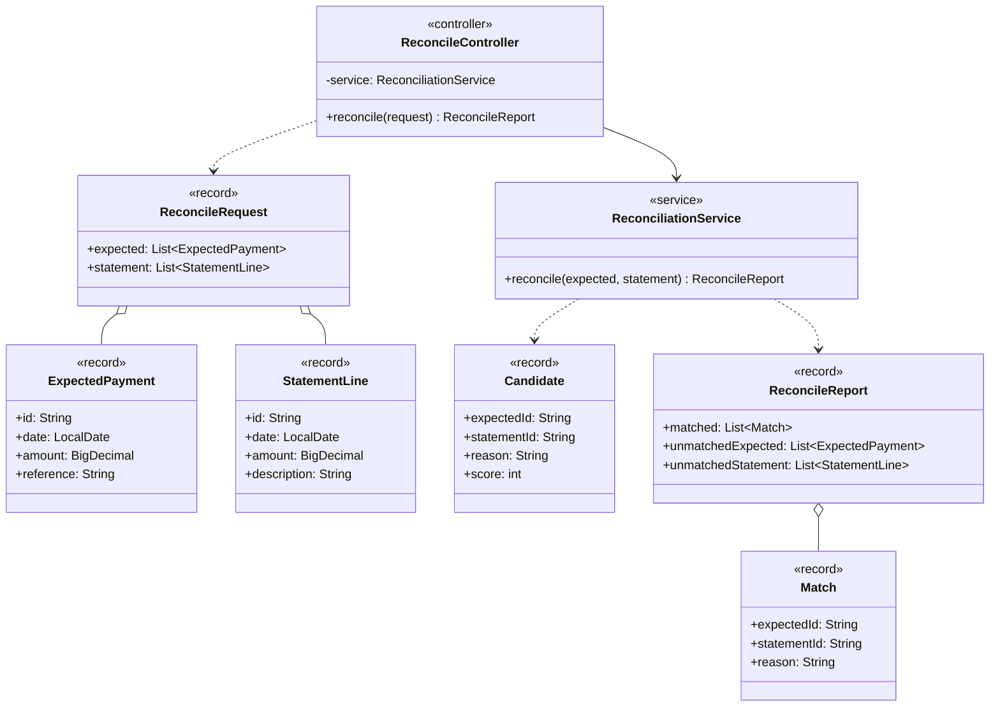

# Bank Statement Reconciler

Matches **expected payments** to **bank statement lines** using amount (±0.01), date (exact or ±2 days), and optional reference text found in the description.

Candidates are scored and the best unused pair is taken first:

1. `amount+date+reference` (best)
2. `amount+near-date+reference`
3. `amount+date`

This avoids the classic greedy trap where a weak same-day match steals a line that should pair with a reference hit.

## Scope (honest)

This is a learning / portfolio matcher, not a production reconciliation platform.

| Capability | Status |
|------------|--------|
| Amount + exact/near-date + reference scoring | Implemented |
| Best-candidate-first matching (avoids greedy same-day trap) | Implemented |
| Fuzzy / typo-tolerant reference matching (e.g. Levenshtein) | Not included (substring match only) |
| Multi-currency reconciliation | Not included |
| Bank feed integrations | Not included |
| Persistence of reconciliation runs | Not included (stateless per-request matcher) |

## Architecture



## API

| Method | Path | Description |
|--------|------|-------------|
| `POST` | `/api/reconcile` | Body with `expected[]` and `statement[]` |
| `GET` | `/api/reconcile/health` | Liveness |

### Example

```bash
curl -s -X POST http://localhost:8088/api/reconcile \
  -H "Content-Type: application/json" \
  -d "{\"expected\":[{\"id\":\"E1\",\"date\":\"2026-06-01\",\"amount\":250.00,\"reference\":\"INV-42\"}],\"statement\":[{\"id\":\"S1\",\"date\":\"2026-06-01\",\"amount\":250.00,\"description\":\"Payment INV-42\"}]}"
```

Response fields: `matched[]` (`expectedId`, `statementId`, `reason`), `unmatchedExpected[]`, `unmatchedStatement[]`.

## Domain model

Class-level view of the main types and how they relate (fields, operations and dependencies).



## Quick start

```bash
./mvnw test
./mvnw spring-boot:run
```

HTTP: `http://localhost:8088`

## Notes

Near-date matching allows a +/- 2 day window when the reference text also matches.

## License

[MIT](LICENSE)
