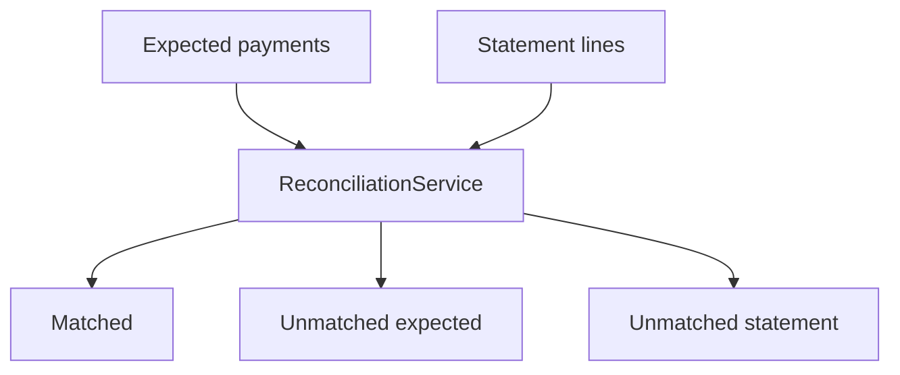

# Bank Statement Reconciler

Matches **expected payments** to **bank statement lines** using amount, date (exact or ±2 days), and optional reference text found in the description.

Typical ops / finance control workflow in miniature form.

## Architecture



## Quick start

```bash
./mvnw test
./mvnw spring-boot:run
```

HTTP: `http://localhost:8088`

```bash
curl -s -X POST http://localhost:8088/api/reconcile \
  -H "Content-Type: application/json" \
  -d "{\"expected\":[{\"id\":\"E1\",\"date\":\"2026-06-01\",\"amount\":250.00,\"reference\":\"INV-42\"}],\"statement\":[{\"id\":\"S1\",\"date\":\"2026-06-01\",\"amount\":250.00,\"description\":\"Payment INV-42\"}]}"
```

## License

[MIT](LICENSE)
